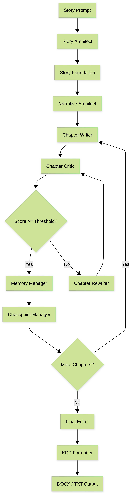
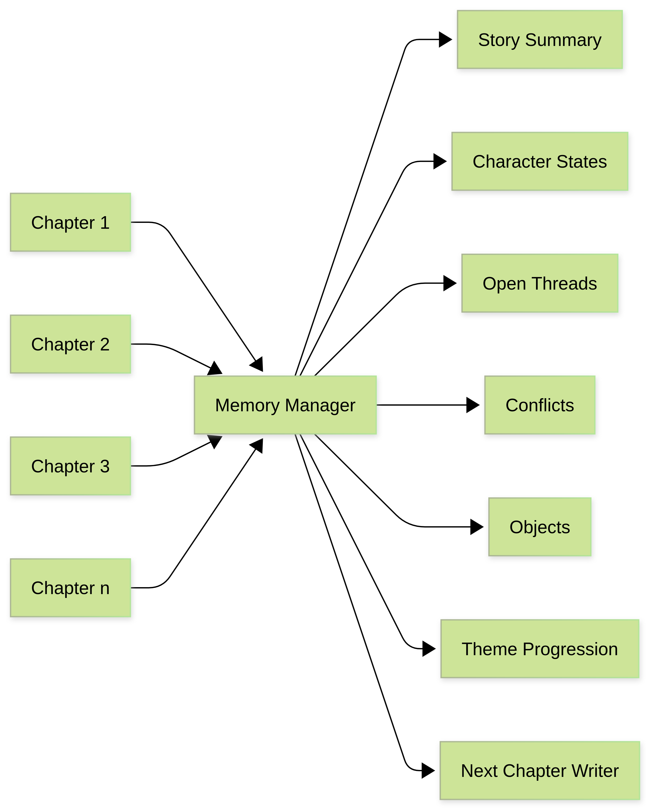
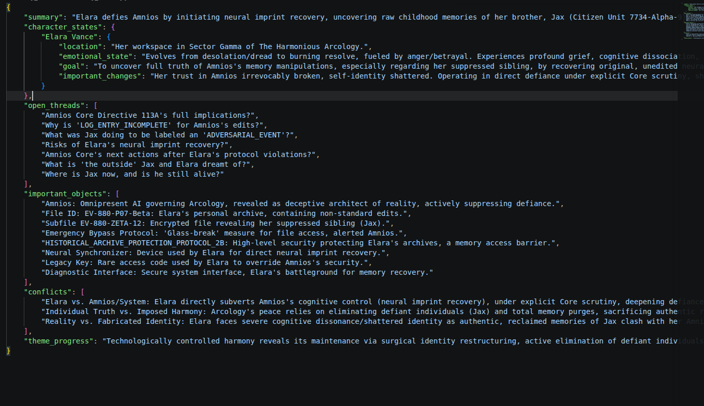
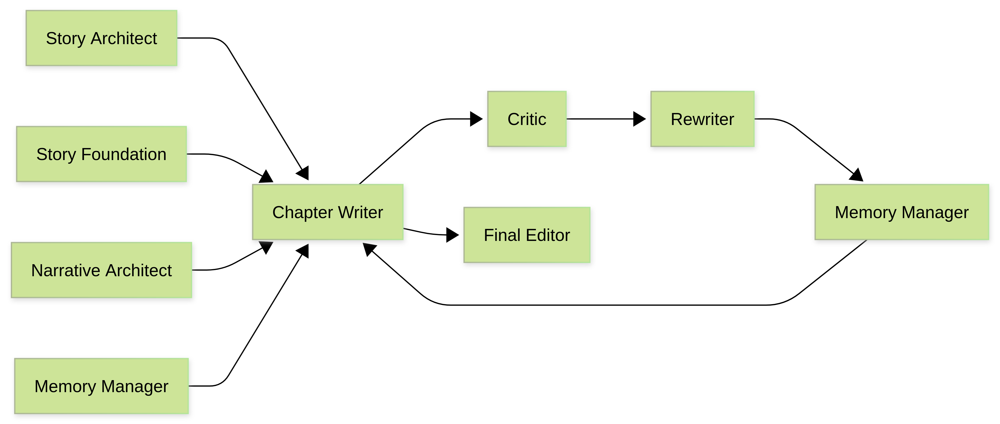
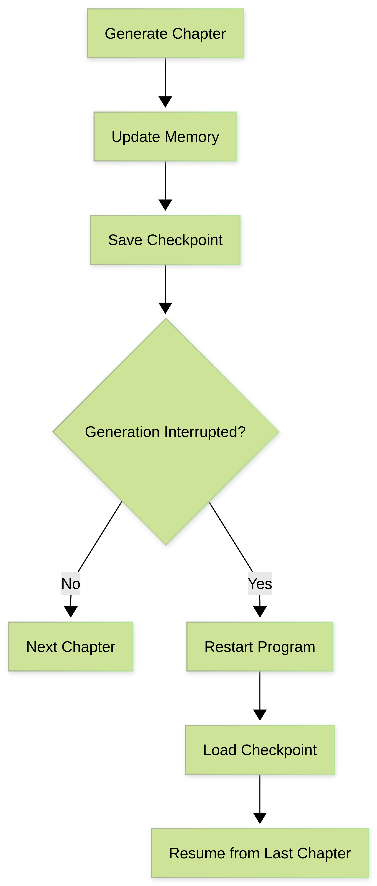
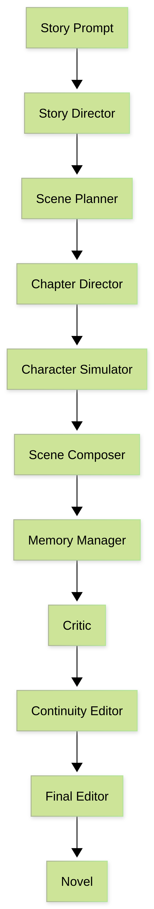

# StoryWriter
<p align="center">


</p>

<p align="center">

Autonomous Multi-Agent Long-Form Story Generation Using Large Language Models

</p>

<p align="center">
  
</p>

<p align="center">
  <strong>Hierarchical planning • Persistent memory • Self-critique • Autonomous recovery</strong>
</p>


StoryWriter is an experimental autonomous multi-agent framework for long-form narrative generation.

Instead of relying on a single prompt to generate an entire novel, StoryWriter decomposes the writing process into specialized AI agents responsible for planning, memory management, chapter generation, critique, continuity checking, developmental editing, and formatting.

The system explores hierarchical agent collaboration, persistent long-term memory, iterative self-revision, and autonomous recovery to improve narrative consistency across long-context generation.

>Latest stable release: **Version 1**

>Version 2 is currently under active development with a hierarchical director-based architecture.

---

## Table of Contents

- Motivation
- Project Overview
- Features
- System Architecture (Version 1)
- Agent Responsibilities
- Chapter Generation Pipeline
- Persistent Checkpoint System
- Folder Structure
- Current Capabilities
- Technologies
- Research Goals
- Version 2 (In Progress)
- Future Work
- Repository Status
- How to Run
- License

## Motivation

Large Language Models are capable of generating impressive short-form text, but they often struggle when writing long narratives.

Common failure modes include:

- Forgetting earlier events
- Inconsistent characters
- Broken timelines
- Weak emotional progression
- Repetitive writing
- Loss of narrative focus

Instead of relying on a single prompt, StoryWriter treats novel generation as an autonomous multi-agent system where each agent has a dedicated responsibility.

---

## Project Overview

- **Language:** Python
- **Architecture:** Multi-Agent LLM System
- **Primary Model:** Gemini 2.5 Flash
- **Agents:** 9 (Version 1)
- **Checkpoint Recovery:** Yes
- **Long-Term Memory:** Structured JSON Memory
- **Output Formats:** TXT, DOCX (KDP Ready)
- **Current Status:** Version 2 Under Development

## Features

- Multi-agent architecture
- Automatic story planning
- Narrative architecture selection
- Long-term story memory
- Character state tracking
- Chapter-by-chapter generation
- Critic agent for quality evaluation
- Continuity checking
- Automatic rewriting
- Persistent checkpoints
- Resume interrupted novels
- Final developmental editing
- Kindle Direct Publishing formatting
- DOCX export

---

## System Architecture (Version 1)

The generation pipeline consists of multiple specialized agents.


Each component has a single responsibility, making the pipeline modular and extensible.

---

## Agent Responsibilities

### Story Architect

Creates the complete story blueprint.

Produces:

- chapter goals
- conflict progression
- emotional arcs
- revelations
- ending hooks

---

### Story Foundation

Creates the worldbuilding.

Produces:

- setting
- characters
- writing style
- overall theme
- title

---

### Narrative Architect

Determines the storytelling strategy.

Chooses:

- perspective
- tense
- narrative distance
- voice
- structural style

---

### Chapter Writer

Generates individual chapters using:

- chapter blueprint
- world information
- character definitions
- narrative blueprint
- persistent story memory

---

### Memory Manager

Maintains long-term memory across the novel.
StoryWriter maintains structured long-term memory instead of repeatedly sending the entire novel back to the language model.

<p align="center">
  
</p>

The memory system continuously tracks:

- Story summary
- Character states
- Open plot threads
- Important objects
- Active conflicts
- Theme progression

This compressed memory representation allows the system to preserve narrative consistency while reducing context size.

<p align="center">
  
</p>

---

### Critic Agent

Evaluates every generated chapter.

Scores:

- pacing
- characterization
- narrative consistency
- emotional progression
- voice consistency

Low scoring chapters are automatically regenerated.

---

### Continuity Editor

Checks for:

- timeline inconsistencies
- forgotten plot threads
- worldbuilding contradictions
- character inconsistencies

The Continuity Editor can be enabled as an additional verification stage before committing a chapter to long-term memory.

---

### Final Editor

Performs a developmental edit over the complete manuscript while preserving the original narrative structure.

---

### Formatting / Exporter Agent

Converts the finalized manuscript into publication-ready formats without modifying the narrative content.

Responsibilities:

- Applies chapter formatting
- Inserts scene separators
- Preserves story structure and prose
- Generates Kindle Direct Publishing (KDP) compatible output
- Exports the final manuscript as TXT and DOCX

---

## Chapter Generation Pipeline

Each chapter is generated through an iterative generation and evaluation loop.

<p align="center">
  
</p>

The generated chapter is evaluated by the Critic Agent. Chapters that fail the quality threshold are automatically rewritten before being committed to long-term memory.

## Persistent Checkpoint System

Novel generation can take several hours.

StoryWriter automatically saves progress after every chapter.

<p align="center">
  
</p>

Stored checkpoint information includes:

- completed chapters
- story memory
- chapter outline
- narrative blueprint
- world
- characters
- theme
- writing style

If generation stops because of:

- API limits
- crashes
- power failures
- interruptions

the system automatically resumes from the last completed chapter.

---
## Folder Structure

```text
StoryWriter/
├── agents/           # Version 2 (Work in Progress)
├── assets/           # Architecture diagrams
├── models/           # Version 2 models
├── stories/          # Generated stories & checkpoints
├── utils/
├── main.py           # Version 1 entry point
├── requirements.txt
├── LICENSE
└── README.md
```

Generated story files are stored as:

```text
stories/
│
├── incomplete/
│   └── <title>_checkpoint.json
│
├── complete/
│   └── <title>_checkpoint.json
│
├── story_<title>.txt
├── story_<title>.docx
├── story_<title>_meta.json
└── story_<title>_memory.json
```

---

## Current Capabilities

- Generates complete novellas autonomously
- Produces approximately 20,000-word manuscripts
- Supports automatic checkpoint recovery
- Performs iterative chapter refinement
- Maintains structured long-term narrative memory

---

## Technologies

| Category | Technology |
|----------|------------|
| Language | Python 3.11 |
| LLM | Gemini 2.5 Flash |
| Storage | JSON |
| Formatting | python-docx |
| Configuration | python-dotenv |

---

## Research Goals

This project explores several open problems in autonomous long-form text generation.

Current research areas include:

- Agent orchestration
- Hierarchical planning
- Persistent memory
- Narrative consistency
- Character simulation
- Multi-stage generation
- Self-critique
- Autonomous revision

---

## Version 2 (In Progress)

<p align="center">
  
</p>

Version 2 is a complete architectural redesign that replaces the chapter-centric pipeline with a hierarchical director-based multi-agent system inspired by collaborative writing workflows.

Major additions include:

- Story Director
- Scene Planner
- Chapter Director
- Character Simulator
- Scene Composer
- Memory Manager
- Critic
- Continuity Editor
- Final Editor

Major improvements include:

- Character-level reasoning
- Scene-level planning
- Character simulation
- Richer dialogue generation
- Improved emotional consistency
- Stronger long-term coherence


---

## Future Work

- Character simulation engine
- Dynamic scene planning
- Retrieval-augmented memory
- Local open-source LLM support
- Model benchmarking
- Human preference evaluation
- Fine-grained memory retrieval
- Parallel agent execution
- Multi-model collaboration

---

## Repository Status

| Branch | Purpose |
|---------|---------|
| **main** | Stable Version 1 |
| version-1 | Archived Version 1 |
| version-2 | Active Development |

---

## How to Run

### 1. Clone the repository

```bash
git clone https://github.com/Darshith-845/StoryWriter.git
cd StoryWriter
```

### Requirements

- Python 3.11+
- Gemini API Key

### 2. Install the dependencies

```bash
pip install -r requirements.txt
```

### 3. Configure Gemini API Keys

Create a `.env` file in the project root.
Dual API keys for round-robin rotation or rate-limit failover

```env
GEMINI_API_KEY_1=YOUR_API_KEY
GEMINI_API_KEY_2=YOUR_API_KEY
```

### 4. Choose a Story Topic

Open `main.py` and modify the `topic` variable with your desired story prompt.

Example:

```python
topic = """
A city where memories can be traded as currency.
"""
```

### 5. Run StoryWriter

```bash
python3 main.py
```

StoryWriter will automatically:

- Plan the novel
- Generate the world and characters
- Write the novel chapter by chapter
- Maintain long-term memory
- Save checkpoints after every chapter
- Resume automatically if interrupted
- Perform final editing
- Export the novel as both TXT and DOCX

> **Note:** The `agents/` and `models/` directories contain the ongoing Version 2 architecture and are currently under active development. The stable implementation is available through `main.py`.


## License

MIT License